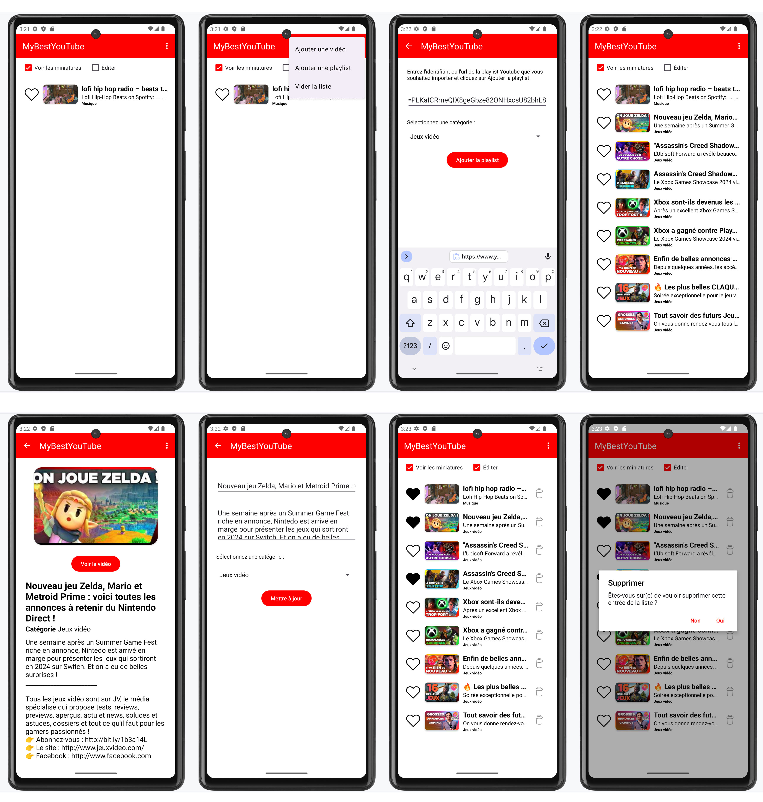

# MyBestYoutube

## Application Android Tiramisu 13 (API 33)

L'application My Best YouTube est une application Android qui permet de gérer une liste personnelle des meilleurs vidéo trouvées sur YouTube. Pour Chaque vidéo on peut renseigner son titre, une description, l'url YouTube et choisir une catégorie (Sport, Music, Comédie, ...).

### Utilisation

L'API de Google Youtube est utilisée pour pouvoir importer les informations de vidéos ou bien des playlists.

La clé d'API doit être renseignée dans un ficher à la racine nommé `api-key.properties` et contenant votre clé de développeur Google.
```
API_KEY=<votre-clé-api>
```

### Copies d'écrans

Testé sur Pixel 6a (émulateur) :


